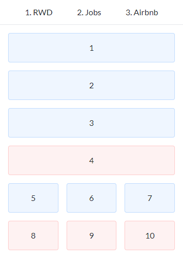
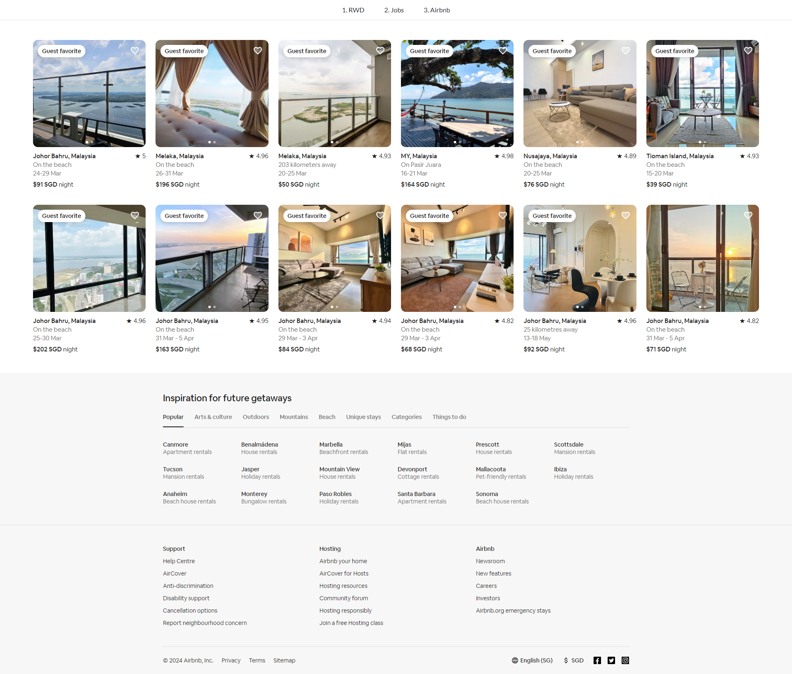
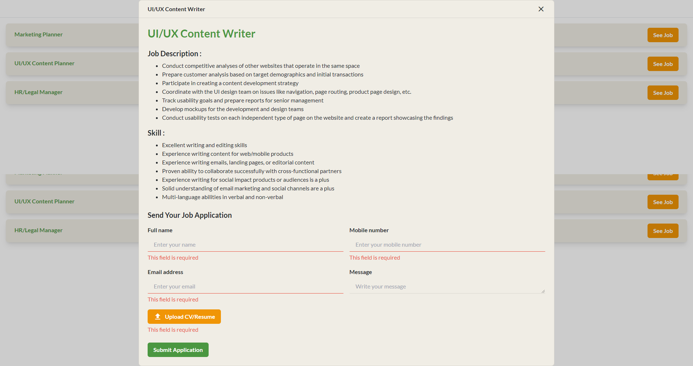

# Test Bionic

## Table of Contents

- [Screen](#screen)
- [Stack](#stack)
- [Prerequisites](#prerequisites)
- [Installation](#installation)
- [Usage](#usage)

## Screen

|                    1. Responsive Layout                     |                         2. Jobs App                          |                        3. Airbnb Clone                        |
| :---------------------------------------------------------: | :----------------------------------------------------------: | :-----------------------------------------------------------: |
|  |  |  |
|                                                             |  |                                                               |

## Stack

- **Vite (SWC):** Bundler
- **React:** Library
- **Redux:** State management
- **React Router:** Routing
- **Axios:** Fetching
- **Tailwind:** CSS framework
- **Fonts:** Lato, Cereal/Circular (Airbnb)
- **Icons:** Material Icons, Airbnb

## Prerequisites

Pastikan komputer sudah terinstal software berikut:

- **[Node.js](https://nodejs.org/en/download)**: versi 20 atau lebih tinggi.
- **[Pnpm](https://pnpm.io)**: Instal Pnpm secara global menggunakan npm dengan perintah berikut:

```
npm install -g pnpm
```

## Installation

1. Unduh proyek ke komputer

```
git clone https://gitlab.com/test-bionic/hrswhdn/test-bionic.git
```

2. Buka folder dan instal dependency proyek

```
cd test-bionic
pnpm install
```

## Usage

1. Ganti nama file .env.example menjadi .env
2. Ubah isi file .env dengan URL dan Password Agricola yang telah dijalankan, contoh:

```
VITE_BASE_URL="https://indonesia.id/layanan/portal/api"
```

3. Jalankan proyek ini

```
pnpm run dev
```

4. Download ekstensi browser Chromium "Allow CORS: Access-Control-Allow-Origin" di Chrome Web Store, lalu nyalakan untuk mem-bypass CORS backend yang digunakan di Jobs App.
